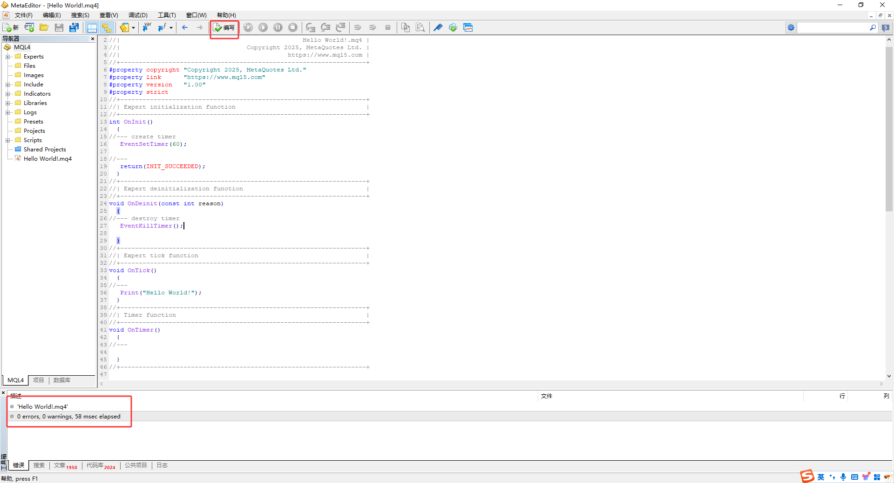
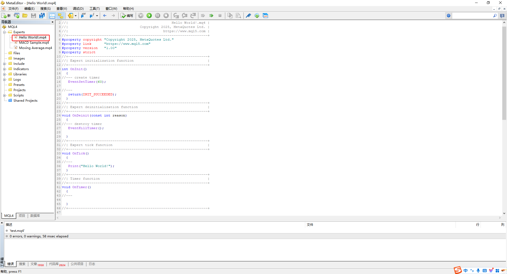
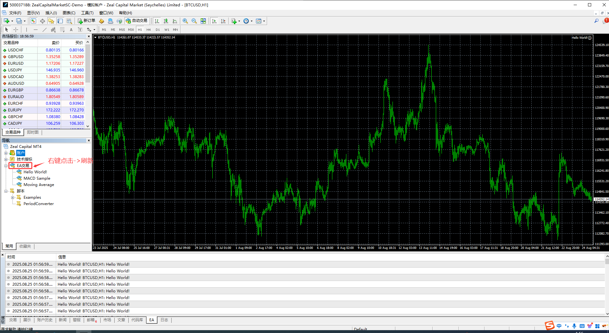
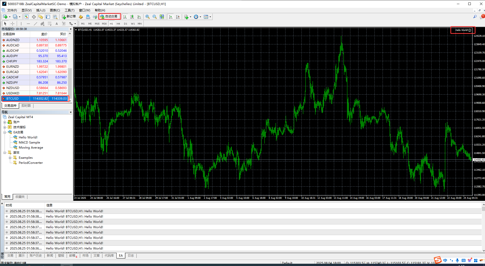
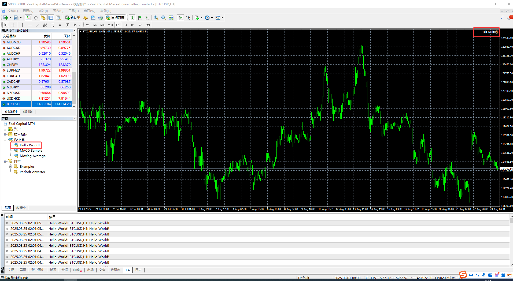
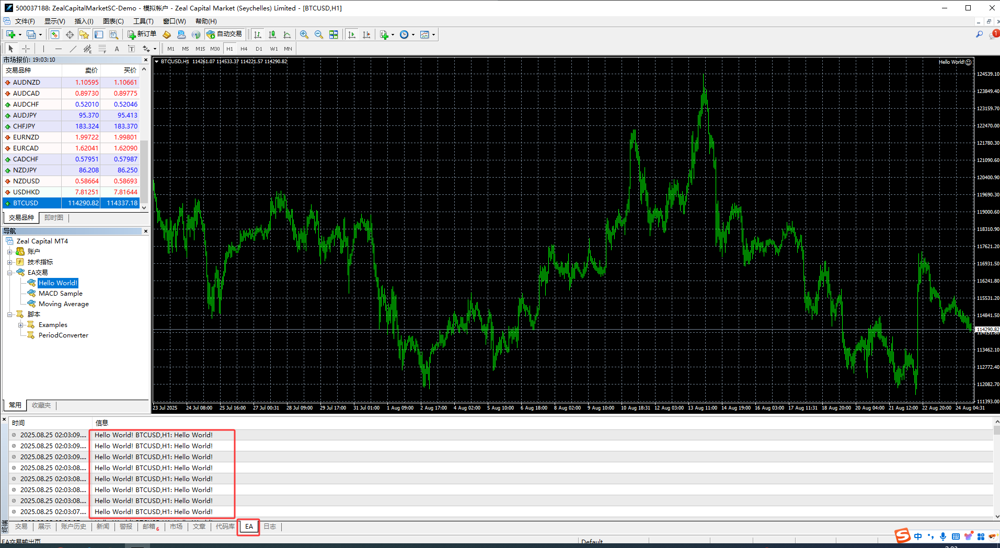

# 2. 编写并加载运行`Hello World`

在`OnTick()`函数中,写入打印语句:

```MQL
//+------------------------------------------------------------------+
//|                                                 Hello World!.mq4 |
//|                                  Copyright 2025, MetaQuotes Ltd. |
//|                                             https://www.mql5.com |
//+------------------------------------------------------------------+
#property copyright "Copyright 2025, MetaQuotes Ltd."
#property link      "https://www.mql5.com"
#property version   "1.00"
#property strict
//+------------------------------------------------------------------+
//| Expert initialization function                                   |
//+------------------------------------------------------------------+
int OnInit()
  {
//--- create timer
   EventSetTimer(60);
   
//---
   return(INIT_SUCCEEDED);
  }
//+------------------------------------------------------------------+
//| Expert deinitialization function                                 |
//+------------------------------------------------------------------+
void OnDeinit(const int reason)
  {
//--- destroy timer
   EventKillTimer();
   
  }
//+------------------------------------------------------------------+
//| Expert tick function                                             |
//+------------------------------------------------------------------+
void OnTick()
  {
//---
   Print("Hello World!");
  }
//+------------------------------------------------------------------+
//| Timer function                                                   |
//+------------------------------------------------------------------+
void OnTimer()
  {
//---
   
  }
//+------------------------------------------------------------------+
```

在`OnTick()`函数中,输入打印语句`Print("Hello World!");`,含义为:当货币对价格跳动一次时就打印一次`Hello World!`.

编写完成后,点击工具栏上方的`"编写"`按钮,若无错误,则会在工具栏显示`"零错误"`,说明EA编写没有问题,已通过编译,可以加载运行.如下图示:



加载运行EA的步骤如下:

- step1. 将刚刚编写的`Hello World!.mq4`移动到`Experts`文件夹下

    

- step2. 刷新EA

    

- step3. 启动自动交易

    

- step4. 双击MT4终端导航栏的EA名称

    

    - 若MT4终端允许该货币对自动交易,则在货币对K线图表的右上角会出现EA的名称和一个笑脸的标志
    - 反之则会出现EA名称和一个哭脸的标志

- step5. 点击终端的EA选项卡,观察运行结果

    

至此,完成了第一个MT4自动化交易程序`Hello World!`的编写和加载.
