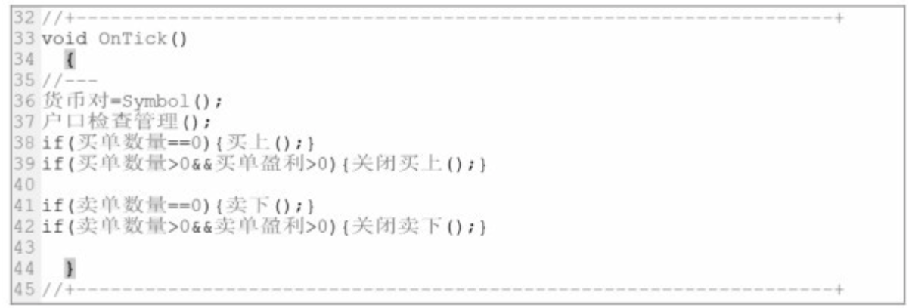

# 2. EA运行规则

EA执行程序语句按照**从上到下/从左到右**的顺序

该示例中,主程序模块中使用的函数为`OnTick()`.即:每当货币对的价格变动1次,主程序就执行1次

- step1. `货币对=Symbol()`

    让EA明确要操作的货币对名称

- step2. `户口检查管理()`

    该子函数是模板中的1个,存放在子函数存储模块(类似于`lib`中的1个库函数).主要完成有关该货币对买卖单数量/买卖单盈亏的计算

- step3. `if(买单数量 == 0) { 买上(); }`

    若买单的数量为0(即没有买单)=,则执行`买上()`,完成一个下买单的动作
    
    TODO: "下买单"是指我要买入的意思吗(也就是说我现在看多)?

- step4. `if( 买单数量 ＞ 0 && 买单盈利 ＞ 0) { 关闭买上(); }`

    若市场上该货币对有买单,且买单的盈利大于零,则就执行`关闭买上()`,把该货币对全部买单平仓
    
    TODO: "市场上该货币对有买单",是指"市场上有人要买,而我之前下过买单,所以手里**有货**,且恰好我现在要卖"的意思吗?

- step5. `if(卖单数量 == 0) { 卖下(); }`

    若卖单的数量为0(即没有卖单),则执行`卖下()`,完成一个下卖单的动作
    
    TODO: "下卖单"是指我要卖出的意思吗(也就是说我现在看空)?

- step6. `if( 卖单数量 ＞ 0 && 卖单盈利 ＞ 0) { 关闭卖下(); }`

    若市场上该货币对有卖单,且卖单的盈利大于零,则就执行`关闭卖下()`,把该货币对全部卖单平仓
    
    TODO: "市场上该货币对有卖单",是指"市场上有人要卖,而我之前下过卖单,所以手里**有钱**,且恰好我现在要买"的意思吗?

每当加载EA的货币对价格变动1次,EA就按照上面的步骤运行1次.一直循环执行,直到退出程序为止.
