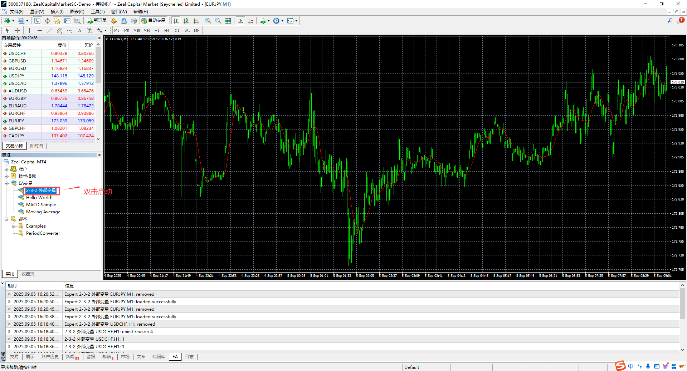
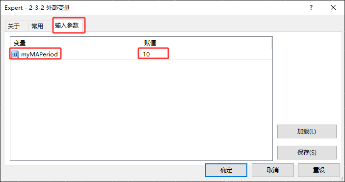

# 2. 外部变量

外部定义的可变变量,在数据类型公布之前指定外部变量.关键字`extern`用于声明一个变量是外部的

- 定义外部变量

```mq4
//+------------------------------------------------------------------+
//|                                                   2-3-2 外部变量.mq4 |
//|                                  Copyright 2025, MetaQuotes Ltd. |
//|                                             https://www.mql5.com |
//+------------------------------------------------------------------+
#property copyright "Copyright 2025, MetaQuotes Ltd."
#property link      "https://www.mql5.com"
#property version   "1.00"
#property strict
extern int myMAPeriod = 1;
```

- 使用外部变量

```mq4
//+------------------------------------------------------------------+
//| Expert tick function                                             |
//+------------------------------------------------------------------+
void OnTick()
  {
//---
   Print(myMAPeriod);
  }
```

- 修改外部变量





注: MQL中的外部变量,有点像GO语言中的`flag`包,可以在编译前,通过命令行参数,修改外部变量的值
