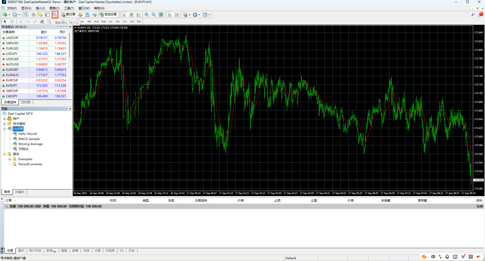
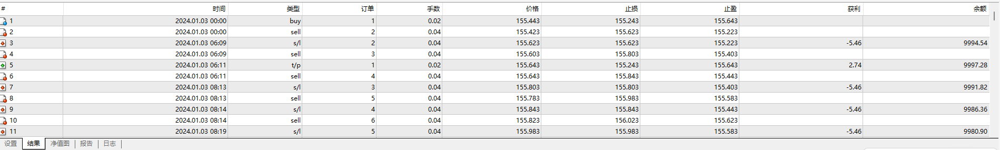
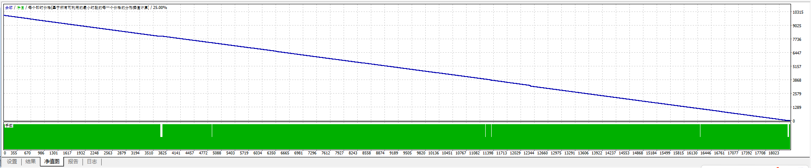
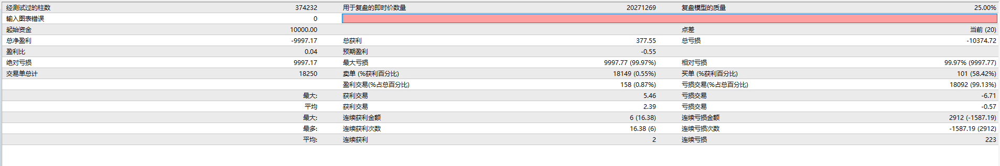
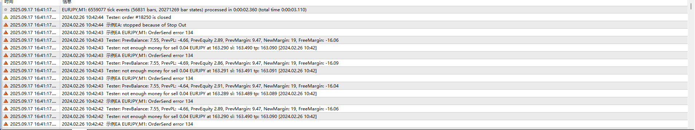

# 2. 开始EA测试

- step1. 启动EA测试界面

- step2. 开始EA测试

- EA交易: 用于选择要测试的EA程序
- 交易品种: 用于选择要测试的货币对
- 复盘模型: 用于选择要测试的复盘模型,通常选择第一个,"每个即时价格"
- 适用日期: 用于选择要测试的时间段
- 复盘显示: 回测的交易情况可以在图表窗口显示
  - 若勾选,则回测的过程会在图表窗口显示
- 时间周期: 用于选择要测试的时间周期

