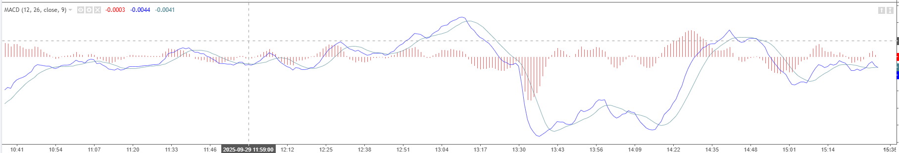

# 2. `MACD`指标



- `MACD`: 指数平滑异同移动平均线(Moving Average Convergence Divergence).由`Gerald Appel`在1970年代末期提出的一种利用移动平均线的技术分析工具.`MACD`通过计算短期和长期的指数移动平均线(`EMA`)之间的差值,来识别价格趋势的变化和动量.它主要由三部分组成:
  - `MACD线`: 计算短期(**12日**)和长期(**26日**)指数移动平均线(`EMA`)之间的差值.公式为:`MACD = EMA(12) - EMA(26)`,又称快线(`DIF`)
    - 注: 这个值是有正负的,正值时在0轴线上方;负值时在0轴线下方
  - `信号线`: 是`MACD`线的**9日**指数移动平均线.公式为:`Signal Line = EMA(MACD, 9)`,又称慢线(`DEA`)
  - `柱状图`: 显示`MACD`线与信号线之间的差值.公式为:`Histogram = MACD - Signal Line`,柱状图又称为能量柱

- `iMACD(string symbol, int timeframe, int fast_ema_period, int slow_ema_period, int signal_sma_period, int applied_price, int mode, int shift)`
  - `symbol`: 交易品种
  - `timeframe`: 时间周期
  - `fast_ema_period`: 快速`EMA`周期(一般为12)
  - `slow_ema_period`: 慢速`EMA`周期(一般为26)
  - `signal_sma_period`: 信号线周期(一般为9)
  - `applied_price`: 价格类型(`PRICE_CLOSE`, `PRICE_OPEN`, `PRICE_HIGH`, `PRICE_LOW`, `PRICE_MEDIAN`, `PRICE_TYPICAL`, `PRICE_WEIGHTED`)
  - `mode`: 指标缓冲区索引
    - `MODE_MAIN`: 返回`MACD`线的值(`DIF`线的值)
    - `MODE_SIGNAL`: 返回信号线的值(`DEA`线的值)
    - `MODE_HISTOGRAM`: 返回柱状图的值(能量柱的值)
  - `shift`: 指定要获取的历史数据的索引(0表示当前柱,1表示前一柱,依此类推)

```mq4
void OnTimer()
  {
//---
   bool goldenCross = false;
   bool deathCross = false;

   double currentMACDDif = iMACD(Symbol(), PERIOD_M1, 12, 26, 9, PRICE_CLOSE, MODE_MAIN, 0);
   double currentMACDDea = iMACD(Symbol(), PERIOD_M1, 12, 26, 9, PRICE_CLOSE, MODE_SIGNAL, 0);
   
   double prevMACDDif = iMACD(Symbol(), PERIOD_M1, 12, 26, 9, PRICE_CLOSE, MODE_MAIN, 1);
   double prevMACDDea = iMACD(Symbol(), PERIOD_M1, 12, 26, 9, PRICE_CLOSE, MODE_SIGNAL, 1);
   
   // 之前DIF < DEA 但是 当前DIF > DEA 就意味着出现金叉了
   if (currentMACDDif > currentMACDDea && prevMACDDif < prevMACDDea) {
      goldenCross = true;
   }
   
   // 之前DIF > DEA 但是 当前DIF < DEA 就意味着出现死叉了
   if (currentMACDDif < currentMACDDea && prevMACDDif > prevMACDDea) {
      deathCross = true;
   }
   
   Print("当前DIF: ", currentMACDDif);
   Print("当前DEA: ", currentMACDDea);
   Print("之前DIF: ", prevMACDDif);
   Print("之前DEA: ", prevMACDDea);
   Print("金叉: ", goldenCross);
   Print("死叉: ", deathCross);
  }
```