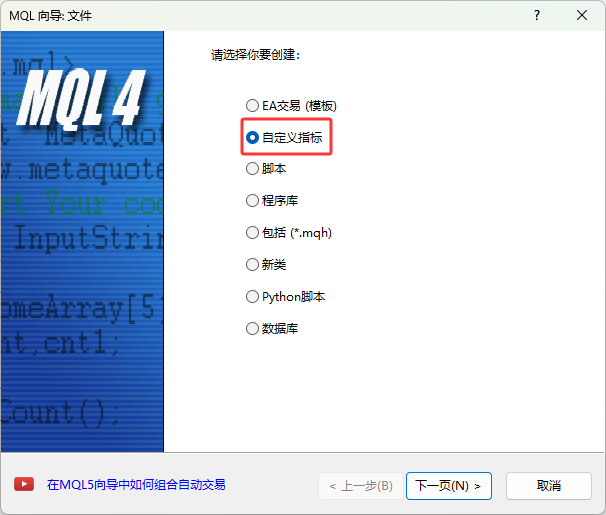
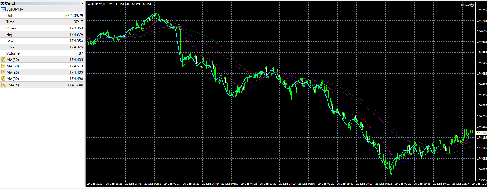

# 3. 自定义指标EA

- step1. 在`Indicators`文件夹下新建指标文件



- step2. 自定义指标代码结构
  - `OnInit()`: 初始化函数,用于设置指标属性
  - `OnDeinit()`: 去初始化函数,用于释放资源
  - `OnCalculate()`: 计算函数,用于计算指标值

- step3. 自定义指标

```mq4
//+------------------------------------------------------------------+
//|                                                          MA5.mq4 |
//|                                  Copyright 2025, MetaQuotes Ltd. |
//|                                             https://www.mql5.com |
//+------------------------------------------------------------------+
#property copyright "Copyright 2025, MetaQuotes Ltd."
#property link      "https://www.mql5.com"
#property version   "1.00"
#property strict
#property indicator_chart_window
// 定义缓冲区数量 缓冲区数量即:自定义指标有几条线
#property indicator_buffers 1
#property indicator_color1 Aqua

input int Period = 5;

// 定义指标缓冲区
double MA5Buffer[];

//+------------------------------------------------------------------+
//| Custom indicator initialization function                         |
//+------------------------------------------------------------------+
int OnInit()
  {
//--- indicator buffers mapping
   // 绑定缓冲区到指标
   SetIndexBuffer(0, MA5Buffer);
   ArraySetAsSeries(MA5Buffer, true);
   SetIndexStyle(0, DRAW_LINE, STYLE_SOLID, 2);
   SetIndexLabel(0, "SMA("+Period+")");
//---
   return(INIT_SUCCEEDED);
  }
//+------------------------------------------------------------------+
//| Custom indicator iteration function                              |
//+------------------------------------------------------------------+
int OnCalculate(const int rates_total,
                const int prev_calculated,
                const datetime &time[],
                const double &open[],
                const double &high[],
                const double &low[],
                const double &close[],
                const long &tick_volume[],
                const long &volume[],
                const int &spread[])
  {
//---
   
//--- return value of prev_calculated for next call
   // prev_calculated: 上次计算的柱数
   // rates_total: 可用历史数据总数
   if (rates_total < Period) {
      return prev_calculated;
   }
   
   int start;
   if (prev_calculated > 0) {
      start = prev_calculated - 1;
   } else {
      start = Period - 1;
   }
   
   for (int i = start; i < rates_total; i++) {
      double sum = 0.0;
      
      for (int k = 0; k < Period; k++) {
         sum += close[i - k];
      }
      
      MA5Buffer[i] = sum / Period;
   }
   
   return(rates_total);
  }
//+------------------------------------------------------------------+
//| Timer function                                                   |
//+------------------------------------------------------------------+
void OnTimer()
  {
//---
   
  }
//+------------------------------------------------------------------+
```

- `#property indicator_buffers 1`: 定义指标有1个缓冲区,即1条线
- `double MA5Buffer[];`: 定义一个数组作为指标缓冲区
- `SetIndexBuffer(0, MA5Buffer);`: 绑定缓冲区到指标
- `ArraySetAsSeries(MA5Buffer, true);`: 将缓冲区数组设置为时间序列
- `SetIndexStyle(0, DRAW_LINE, STYLE_SOLID, 2);`: 设置指标线的样式为实线,宽度为2
- `SetIndexLabel(0, "SMA("+Period+")");`: 设置指标线的标签
- `OnCalculate()`: 计算函数,用于计算指标值
  - `rates_total`: 可用历史数据总数
  - `prev_calculated`: 上次计算的柱数
  - `time[]`: 时间数组
  - `open[]`: 开盘价数组
  - `high[]`: 最高价数组
  - `low[]`: 最低价数组
  - `close[]`: 收盘价数组
  - `tick_volume[]`: Tick成交量数组
  - `volume[]`: 实际成交量数组
  - `spread[]`: 点差数组


