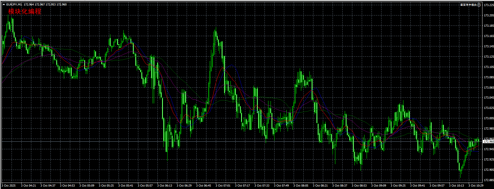

# 1. 画面写字模块

```mq4
void OnTick()
  {
//---
   writeFont("showFont", "模块化编程", 20, 20, 16, "黑体", Red, 0);
  }

//+------------------------------------------------------------------+
// 本函数用于在K线图界面中书写文字
// objName 物件名称
// content 文本内容
// positionX X位置
// positionY Y位置
// fontSize 字号大小
// fontFamily 字体样式
// fontColor 字体颜色
// positionCorner 角落位置
void writeFont(string objName, string content, double positionX, double positionY, int fontSize, string fontFamily, color fontColor, double positionCorner) {
   // 若不存在该物件 则创建该物件
   if (ObjectFind(0, objName) == -1) {
      // 创建的物件类型为 OBJ_LABAL
      ObjectCreate(objName, OBJ_LABEL, 0, 0, 0);
      // 设置该物件的 文字内容 字体大小 字体样式 字体颜色
      ObjectSetText(objName, content, fontSize, fontFamily, fontColor);
      // 设置该物件的角落位置
      ObjectSet(objName, OBJPROP_CORNER, positionCorner);
      // 设置该物件的X坐标
      ObjectSet(objName, OBJPROP_XDISTANCE, positionX);
      // 设置该物件的Y坐标
      ObjectSet(objName, OBJPROP_YDISTANCE, positionY);
   }
}
```

- `ObjectFind(long chart_id, string object_name)`: 查找图表中是否存在指定名称的图形对象
  - 若对象存在,则该函数返回该对象所在的图表窗口编号(`subwindow index`)
  - 若对象不存在,则返回`-1`
- `ObjectCreate(string name, ENUM_OBJECT type, int sub_window, datetime time1, double price1, [datetime time2, double price2, ..., datetime timeN, double priceN])`: 创建图形对象
  - `name`: 对象名称
  - `type`: 对象类型
    - `OBJ_LABEL`: 标签对象,用于在图表上显示文本信息
    - `OBJ_TREND`: 趋势线
    - `OBJ_RECTANGLE`: 矩形
    - `OBJ_TEXT`: 文本
    - `OBJ_ARROW`: 箭头
    - `OBJ_LABEL`: 标签
    - 等等
  - `sub_window`: 子窗口编号,`0`表示主图窗口
  - `time1`和`price1`: 对象的时间和价格位置,对于标签对象可以设置为`0`.不同对象类型需要的锚点数不同:
    - 趋势线(`OBJ_TREND`): 需要2个锚点`(time1, price1)`和`(time2, price2)`
    - 矩形(`OBJ_RECTANGLE`): 需要2个锚点`(time1, price1)`和`(time2, price2)`
    - 文本(`OBJ_TEXT`): 需要1个锚点`(time1, price1)`
- `ObjectSetText(string name, string text, int font_size, string font, color color)`: 设置图形对象的文本属性
  - `name`: 对象名称
  - `text`: 显示的文本内容
  - `font_size`: 字体大小
  - `font`: 字体名称
  - `color`: 字体颜色
- `ObjectSet(string name, int property_id, double value)`: 设置图形对象的属性
  - `name`: 对象名称
  - `property_id`: 属性标识符
    - `OBJPROP_CORNER`: 角落位置属性,用于设置对象在图表中的位置
      - `0`: 左上角
      - `1`: 右上角
      - `2`: 左下角
      - `3`: 右下角
    - `OBJPROP_XDISTANCE`: X轴距离属性,用于设置对象相对于角落位置的水平偏移量
    - `OBJPROP_YDISTANCE`: Y轴距离属性,用于设置对象相对于角落位置的垂直偏移量
  - `value`: 属性值


