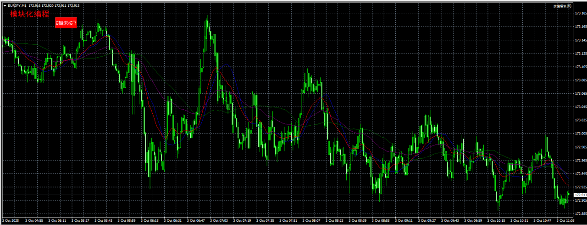

# 2. 按键模块

```mq4
void OnTick()
  {
//---
   createButton("myButton", "按键未按下", "按键已按下", 146, 40, 100, 40, 0, Red, White, 10);
  }
//+------------------------------------------------------------------+
// 本函数用于在K线图界面中创建按键
// objName 按键名称
// notPressedText 未被按下时显示的文本
// pressingText 被按下时显示的文本
// positionX X位置
// positionY Y位置
// width 按键宽度
// height 按键高度
// positionCorner 角落位置
// pressingFontColor 被按下时的文本颜色 & 没有被按下时的背景颜色
// pressingBgColor 被按下时的背景颜色 & 没有被按下时的文本颜色
// fontSize 字号
void createButton(string objName, string notPressedText, string pressingText, int positionX, int positionY, int width, int height, int positionCorner, color pressingFontColor, color pressingBgColor, int fontSize) {
   if (ObjectFind(0, objName) == -1) {
      // 创建按键
      ObjectCreate(0, objName, OBJ_BUTTON, 0, 0, 0);
      // 设置按键的X坐标
      ObjectSetInteger(0, objName, OBJPROP_XDISTANCE, positionX);
      // 设置按键的Y坐标
      ObjectSetInteger(0, objName, OBJPROP_YDISTANCE, positionY);
      // 设置按键的宽度
      ObjectSetInteger(0, objName, OBJPROP_XSIZE, width);
      // 设置按键的高度
      ObjectSetInteger(0, objName, OBJPROP_YSIZE, height);
      // 设置按键的文字字体
      ObjectSetString(0, objName, OBJPROP_FONT, "微软雅黑");
      // 设置按键上的文字大小
      ObjectSetInteger(0, objName, OBJPROP_FONTSIZE, fontSize);
      // 设置按键的角落位置
      ObjectSetInteger(0, objName, OBJPROP_CORNER, positionCorner);
      // 设置在K线图界面中优先接收鼠标点击事件
      ObjectSetInteger(0, objName, OBJPROP_ZORDER, 0);
   }
   
   // 按键被按下时的设置
   if (ObjectGetInteger(0, objName, OBJPROP_STATE) == 1) {
      // 设置按键被按下时的文本颜色
      ObjectSetInteger(0, objName, OBJPROP_COLOR, pressingFontColor);
      // 设置按键被按下时的背景颜色
      ObjectSetInteger(0, objName, OBJPROP_BGCOLOR, pressingBgColor);
      // 设置按键被按下时的文本内容
      ObjectSetString(0, objName, OBJPROP_TEXT, pressingText);
   } else {
      // 设置按键没有被按下时的文本颜色
      ObjectSetInteger(0, objName, OBJPROP_COLOR, pressingBgColor);
      // 设置按键没有被按下时的背景颜色
      ObjectSetInteger(0, objName, OBJPROP_BGCOLOR, pressingFontColor);
      // 设置按键没有被按下时的文本内容
      ObjectSetString(0, objName, OBJPROP_TEXT, notPressedText);
   }
   
   /*
   Print(123);
   Print(ObjectGetInteger(0, objName, OBJPROP_STATE));
   */
}
```

- `ObjectSetInteger(0, objName, OBJPROP_ZORDER, 0)`: 设置图形对象的堆叠顺序属性
  - `OBJPROP_ZORDER`: 堆叠顺序属性,用于设置对象在图表中的显示优先级
    - `0`: 最高优先级,对象显示在最前面,优先接收鼠标点击事件
    - `1`: 次高优先级
    - `2`: 较低优先级
    - 以此类推,数字越大,优先级越低,对象显示在后面
- `ObjectGetInteger(0, objName, OBJPROP_STATE)`: `OBJPROP_STATE`只对UI类控件有效,表示控件的当前状态
  - 对于按钮(`OBJ_BUTTON`):
    - `0`: 按钮未被按下
    - `1`: 按钮被按下


